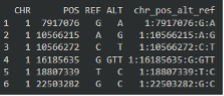
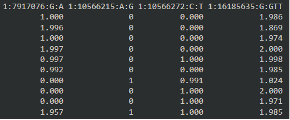
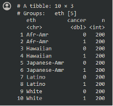
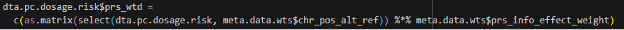
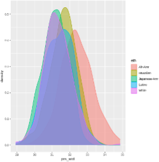
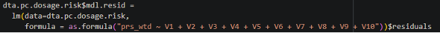
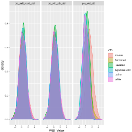
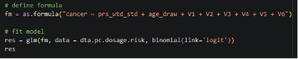
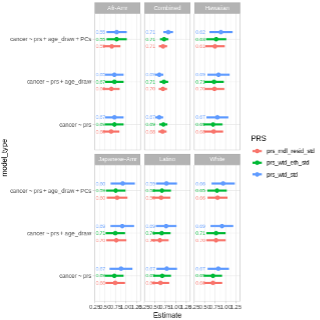

## Practical session: Perform multi-population PRS evaluation:
### Goals of Analysis
1. Import and format data for analysis
2. Check risk allele vs meta-data coding of alleles
3. Examine sample descriptive statistics (case counts by race/eth)
4. Calculate a weighted and non-weighted PRS
5. Examine descriptive statistics of the weighted PRS
6. Calculate “residualized PRS”
7. Standardize all PRSs (residualized, race/eth standardized within group, total sample standardized)
8. Re-examine descriptives statistics of PRS
9. Conduct Regression Analysis
10. Examine model fit
11. Compare all models

#### 1. Import and format data for analysis:
 
Data for this type of analysis is held in three files:
1) Sample meta-data file (dta.PC.MetaData.rds, dta.meta.data), which has information on what “dosage” values in the individual level sample data correspond to.

|  | 
| *Here, variant 1:7917076:G:A, contains information on that variable in the individual-level data. For example, this variant has an “ALT” of A, meaning dosages values in the individual level data correspond to the number of copies of the “A” allele.* |

2) Sample individual-level dosage data (dta_PC_PRS_dosage.rds, dta.pc.dosage), which has individual level dosage information for the variants in the meta-data file. Included in this data are also covariates used in analysis.

|  | 
| *Here, each row in a person and each column corresponds to a variant. The first variant, as we see in the meta-data file, corresponds to the number of “A” alleles. The person in row 1 has 1 A allele, so their other must be “G”.* |

3) The last file we need is the PRS weights file (PRS.weights.rds, PRS.weights.data) this file is used to determine how much each variant dosage contributes to the total PRS. These values are frequently log(OR), where OR is from prior meta-analyses studies.

#### 2. Examine sample descriptive statistics (case counts by race/eth)
 
When we look at the individual level data and the variable for case status, we see 200 cases and 200 controls from each group:

|  | 

#### 3. Calculate a weighted and non-weighted PRS
##### Appending weights to meta-data file
- We use the “row_pull” function to append the PRS weights from the weight data onto your meta data. Then we will only need to work with the individual level data and the meta data.
- “row_pull” is basically a merge function that merges on CHR, POS, ALT, REF, however it allows for (ALTmeta=ALTwt & REFmeta=REFwt) \| (REFmeta=ALTwt & ALTmeta=REFwt) in the merge process between the two data frames.

##### Correcting/updating dosage
- Next we use the “correct dosage” function to “flip” the individual level dosage to ensure that larger dosage values correspond to a greater number of risk alleles.

##### Calculate PRSs

|  | 
| *Using this code, we calculate the weighted PRS using matrix multiplication.* |

#### 4. Examine sample descriptive statistics (case counts by race/eth)
Next, we take a look at the PRS distributions:

|  | 
| *It appears that African Americans and Native Hawaiians have higher PRS, however we want to remove the variation in the PRS due to ancestry, then see if they still have higher PRS.* |

#### 5. Calculate “residualized PRS”
 
To remove the variation of ancestry within the PRS, we adjust for principal components, then take the residuals from this model. -The residual variation represents the variation in PRS that is not captured by ancestry (PCs).

|  | 

#### 6. Standardize all PRSs (residualized, race/eth standardized within group, total sample standardized)
 
In order to interpret the PRSs as an association “per standard deviation” in the base population, we must standardize the PRSs we want to examine by the controls.

Here we standardize the all PRSs using the formula [PRS-mean(PRScontrols)]/sd(PRScontrols). 

We conduct 3 types of standardization: 
1) Standardizing the “residualized PRS” by the control distribution in the total sample
2) standardizing the raw PRS by the control distribution in the total sample
3) standardizing the raw PRS by the control distribution within each race/ethnic group.

Following this standardization, all PRSs should have mean = 1 and SD = 1 within each of the groups (total or self-reported race/eth) we standardized in.

#### 7. Re-examine descriptives statistics of PRS 

|  | 

When we compare the distribution of all these PRSs, we see that after standardization, the mean PRS is much more comparable between groups. 

Specifically, we no longer see African-Americans having a higher mean PRS for the residualized PRS. **-This should make us think more about why African Americans have higher risk of prostate cancer. Is the risk captured in the PRS? Is it ancestry? Is it self-reported race/eth? Is the possibly other variables associated with these variables?**

#### 8. Conduct Regression Analysis

Finally, let us run a comprehensive PRS analysis, examining the association between PRS and prostate cancer, adjusting for age at sample collection and global ancestry (estimated with PCs, labeled PC1-6).

|  | 

With these results we can check the PRS estimate for log(OR) per 1 SD increase in PRS (0.82, OR = exp(0.82) = 2.27), the p-value of the association (p=1.708815e-44), and the AUC (0.7075).

Since PCs and age are strong predictors of PRS, we should compare the AUC from this full model, including the PRS against a simple model just including age and PCs. -The simple model has AUC = 0.5832, so we see a considerable increase in predictive performance when we include information on polygenic risk, as a PRS.

##### Comparing a variety of Models

Since there are many PRSs to use and ways to model associations (ie. Adjusting just for age or age and PCs), we can create a dataset with all of these models and “map” a regression analysis over the data frame, then extract results to compare their estimates (OR, 95% CIs, and AUCs).

|  | 

In our results, we see some variation but a lot of agreement between models, which is great.

### Let's get started 
Please go ahead and open the [07_multi_ancestry_analysis.ipynb](https://github.com/DCEG-workshops/statgen_workshop_tutorial/blob/main/src/07_multi_ancestry_analysis.ipynb) Google colab notebook. 

